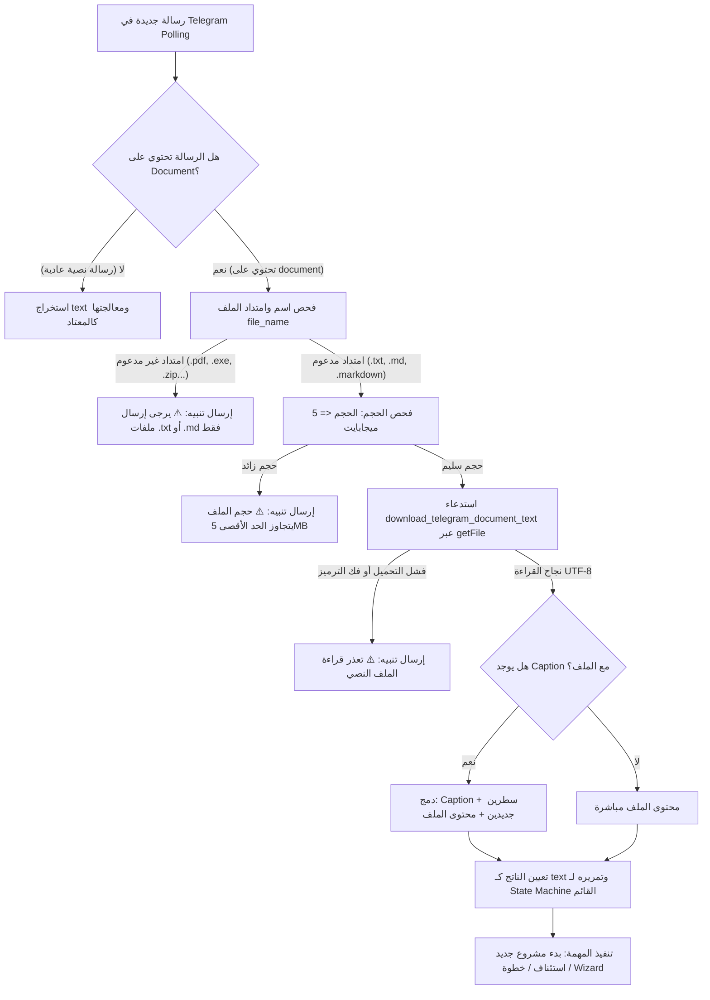
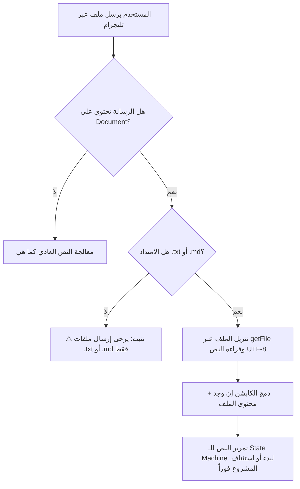

# 📄 وثيقة المعمارية والمواصفات الهندسية: Phase 28 — Telegram Document Ingestion (.txt & .md)

> **المشروع:** Genspark Multi-Project WebApp Bridge System  
> **الإصدار المستهدف:** `01.34` (أو الترقية النشطة بعد 01.33)  
> **الميزة:** استقبال ومعالجة الملفات النصية المباشرة (`.txt` و `.md` و `.markdown`) عبر شات تليجرام  
> **المبدأ الأساسي:** Single-File Doctrine + Zero Breaking Changes + Strict Quality Gates (Exit Code 0)  

---

## 🎯 1. الهدف من الميزة (Business & Technical Goal)

تمكين المستخدم من إرسال برومبتات ومواصفات وتعديلات المشاريع الطويلة عبر ملفات نصية (`.txt` / `.md`) مباشرة في شات التيليجرام دون التقيد بحد الرسائل الأقصى في تليجرام (4096 حرف)، مع تنزيل الملف بترميز UTF-8 آمن وتمريره مباشرة لنفس خط أنابيب معالجة المهام البرمجية القائم.

---

## 📐 2. المواصفات الهندسية والمعمارية (Architecture & Ingestion Flow)



---

## ⚙️ 3. القواعد والضوابط الصارمة (Strict Engineering Directives)

1. **الامتدادات المسموحة (Allowed Extensions):**
   - حصر الامتدادات المدعومة في: `ALLOWED_DOCUMENT_EXTENSIONS = frozenset({".txt", ".md", ".markdown", ".text"})`.
2. **حد الحجم الأقصى (Max File Size):**
   - `MAX_DOCUMENT_SIZE_BYTES = 5 * 1024 * 1024` (5 ميجابايت).
3. **دالة التحميل المركزية (Core Download Helper):**
   - `download_telegram_document_text(file_id: str) -> str | None`:
     - استدعاء `https://api.telegram.org/bot{TOKEN}/getFile?file_id={file_id}`.
     - استخراج `file_path` وتنزيل الملف من `https://api.telegram.org/file/bot{TOKEN}/{file_path}`.
     - فك الترميز بـ `response.content.decode("utf-8", errors="replace")`.
4. **معالجة الشرح المرفق (Caption Handling):**
   - لو أرسل المستخدم شرحاً (Caption) مع الملف، يتم دمجه كالتالي:
     `text = f"{caption}\n\n{file_content}".strip()`
5. **التعامل مع الـ States في الـ Wizard:**
   - إذا كان البوت في حالة انتظار نص معين (مثل `AWAITING_NEW_PROMPT` أو `AWAITING_PROJECT_SETTINGS_RESUME_PROMPT` أو التعديل المباشر)، يُعامل محتوى الملف كأنه النص المُدخل تماماً.
6. **عدم كسر المعالجات الحالية (Zero Regression):**
   - الرسائل النصية العادية تعمل كما هي 100% دون أي تغيير.

---

## 🧪 4. حزمة الاختبارات المطلوبة (`tests/test_p28_document_input.py`)

إنشاء حزمة اختبارات شاملة تغطي:
- ✅ قبول ملفات `.txt` وتنزيلها وقراءة محتواها.
- ✅ قبول ملفات `.md` وقراءة محتواها بتنسيق Markdown.
- ✅ دمج الـ Caption المرفق مع محتوى الملف بشكل صحيح.
- ✅ رفض الامتدادات غير المدعومة (مثل `.zip` / `.pdf` / `.py`) مع إرسال التنبيه المناسب.
- ✅ رفض الملفات التي تتجاوز 5MB.
- ✅ معالجة أخطاء الشبكة أثناء `getFile` بدون حدوث Crash في البوت.
- ✅ تمرير النص بنجاح إلى `process_user_task_async` وخطوات الـ Wizard.

---

## 📋 5. خطة المهام التتابعية (Micro-Tasks M1 ➔ M6)

* **M1 — Helpers:** بناء `download_telegram_document_text` وثوابت `ALLOWED_DOCUMENT_EXTENSIONS` و `MAX_DOCUMENT_SIZE_BYTES`.
* **M2 — Dispatcher Ingestion:** تحديث `handle_telegram_update` في مسار `if "message" in update:` لاستخراج الـ document وقراءته وحقن الناتج في `text`.
* **M3 — Feedback Messages:** إضافة رسائل الإشعار والتنبيهات المنسقة عند رفض الملفات أو نجاح قراءتها.
* **M4 — Unit Tests:** كتابة حزمة `tests/test_p28_document_input.py` وضمان اجتيازها بالكامل.
* **M5 — Parity & Rebuild:** إعادة حساب فواصل `PARTS` وتوليد `bridge_refactor/` بتطابق بايت تام (11/11 Parity).
* **M6 — Quality Gate & Docs:** تشغيل `hadith_sijil.py` للتأكد من خروج البوابة بـ Exit Code 0 وتحديث `PROGRESS.md` و `SESSION_LOG.md`.


Viewed 05_%E2%80%94.txt_&_.md-Document_Ingestion.md:1-90
Created 05_%E2%80%94.txt_&_.md-Document_Ingestion.md

### 🚀 البرومت المعماري الشامل والجاهز لنسخه وإرساله للمحرر:

---

انسخ النص اللي بين القوسين ده وابعته للمحرر فوراً:

```markdown
يا هندسة، خطتنا التالية هي تنفيذ ميزة:
«استقبال وتغذية البرومبتات عبر الملفات النصية المباشرة (Phase 28 — Telegram Document Ingestion: .txt & .md Support)»

📖 المرجع الهندسي للميزة موثق بالكامل في ملف:
`05_—.txt_&_.md-Document_Ingestion.md`

🎯 ملخص المطلوب ونطاق الميزة:
1️⃣ استقبال الملفات النصية:
- تمكين البوت من استقبال ملفات `.txt` و `.md` و `.markdown` المرسلة في شات تليجرام واستخراج محتواها النصي بترميز UTF-8 آمن عبر Telegram API (`getFile` ثم تحميل محتوى الملف).
- دمج الشرح (Caption) إن وُجد أعلى محتوى الملف بشكل منظم (`f"{caption}\n\n{content}"`).

2️⃣ حقن المحتوى في مسارات العمل:
- معاملة النص المستخرج كأنه برومبت مكتوب مباشرة في الشات ليمر في نفس خط أنابيب الـ State Machine الحالي (بدء مشروع جديد، استئناف، أو خطوات الـ Wizard) دون أي كسر وظيفي.

3️⃣ الحراسة والأمان:
- حد أقصى للحجم: `MAX_DOCUMENT_SIZE_BYTES = 5 * 1024 * 1024` (5MB).
- رفض الامتدادات الأخرى (مثل .pdf, .zip, .exe) مع إرسال تنبيه ودي للمستخدم: «⚠️ يرجى إرسال ملفات نصية بامتداد .txt أو .md فقط».
- الحفاظ التام على عمل الرسائل النصية العادية دون أدنى مساس.

4️⃣ الاختبارات والجودة:
- بناء حزمة اختبارات شاملة في `tests/test_p28_document_input.py` تغطي تنزيل وقراءة الملفات، فحص الامتدادات، الحجم الأقصى، معالجة الـ Caption، وحالات الخطأ.
- إعادة حساب PARTS وتوليد `bridge_refactor/` بتطابق بايت 11/11 (Parity 100%).
- الحفاظ على خروج بوابة `hadith_sijil.py` بـ Exit Code 0 مع اجتياز كافة الاختبارات (369+ Pass).

🛡️ ضوابط المرحلة الأولى (INSPECT ONLY):
- ابدأ أولاً بفحص سورس الكود الميداني وتحديد أماكن التعديل المقترحة ودوال التحميل.
- ⛔ توقف بعد مرحلة الفحص واعرض عليّ تقرير الـ Inspection وخطة الـ Micro-Tasks وانتظر موافقتي الصريحة قبل تعديل أي ملف كود! 🚀✨
```

---

🔍 نقد ذاتي:
1. ✅ هل تم توثيق المواصفات كاملة في ملف `05_—.txt_&_.md-Document_Ingestion.md` وحفظها في المشروع؟ نعم.
2. ✅ هل تم صياغة البرومت بأسلوب هندسي دقيق وشامل يحدد المخرجات وضوابط الجودة؟ نعم.
3. ✅ هل تم تفعيل شرط التوقف عند بوابة الفحص (Inspect Only) لمنع الكود الأعمى؟ نعم.


Searched for "document"
Viewed 01.33_telegram_gen_bridge.py:6380-6450
Viewed 01.33_telegram_gen_bridge.py:6480-6600
Viewed 01.33_telegram_gen_bridge.py:6300-6380
Viewed 01.33_telegram_gen_bridge.py:5840-5910
Searched for "update.get"
Searched for "callback_query"
Searched for "def handle_telegram_update"
Viewed p12_handlers_main.py:1-60
Viewed p12_handlers_main.py:500-560
Viewed p12_handlers_main.py:590-650

### 🎯 فاهمك جداً 1000% يا زيزو! دي ميزة عبقرية وهتريحك جداً 🚀🔥

---

### 💡 الفكرة والميزة إيه بالضبط؟
بدل ما تضطر تنسخ وتلصق نصوص وبرومبتات طويلة في شات تليجرام (وتعاني من حد تليجرام الأقصى للرسائل 4096 حرف):
* تبعت للبوت ملف **`.txt`** أو **`.md`** مباشرة في الشات (سواء برومبت جديد، مواصفات موقع، كود، أو ملف تعليمات).
* البوت يتعرف على الملف فوراً، ينزل محتواه ويقرأه بترميز UTF-8، ويتعامل معاه **كأنه برومبت مكتوب بالملي** ويبدأ يشتغل عليه!

---

# 📋 خطة المعمارية الهندسية لميزة: `P28 — Document Ingestion (.txt & .md)`



---

### ⚙️ الضوابط والمعمارية المقترحة للميزة:

1. 📂 **الامتدادات المعتمدة:**
   - `.txt` (Text Files)
   - `.md` و `.markdown` (Markdown Documentation)

2. 📥 **طريقة التنزيل والمعالجة:**
   - دالة `download_telegram_document_text(file_id)`:
     تستعلم من تليجرام عبر `getFile?file_id=...` ➔ تجلب مسار الملف ➔ تقرأ محتواه النصي وتحوله لـ `text`.
   - لو الملف مرفق معاه **Caption (شرح)**: يدمج الكابشن مع محتوى الملف بشكل منظم.

3. 🛡️ **حراسة الأمان والحجم:**
   - حد أقصى للحجم (مثلاً **5 ميجابايت** — وهو كافٍ لملايين السطور النصية).
   - حماية من الملفات الثنائية (Binary) غير القابلة للقراءة بـ UTF-8 مع رسالة تنبيه ودية.

4. 🔄 **التوافق التام (Zero Breaking Changes):**
   - النص المستخرج من الملف هيدخل في نفس مسارات معالجة البرومبتات القائمة (سواء مشروع جديد أو استئناف أو إعدادات).

---

### 🚀 خطة المهام المقترحة للمحرر (Micro-Tasks M1 ➔ M5):

* **M1 — Helper:** بناء دالة `download_telegram_document_text(file_id)` عبر Telegram API.
* **M2 — Ingestion Handler:** في دالة `handle_telegram_update`، فحص `msg.get("document")` واستخراج النص وحقنه في دورة الـ Prompt.
* **M3 — Extensions & Captions Guard:** التحقق من امتدادات `.txt` و `.md` ودمج الـ Caption تلقائياً.
* **M4 — Unit Tests:** إنشاء ملف اختبارات جديد `tests/test_p28_document_input.py` يختبر تنزيل الملفات، فحص الامتدادات، UTF-8 decoding، والملفات المرفوضة.
* **M5 — Parity & Quality Gate:** تحديث خريطة `PARTS` وإعادة توليد `bridge_refactor/` واجتياز كافة الاختبارات (369+) وخروج بوابة `hadith_sijil.py` بـ Exit Code 0.

---

جاهز أصيغلك البرومت المعماري الكامل للمحرر عشان تبعتهوله يبدأ في **P28**؟ 🫡✨

---

🔍 نقد ذاتي:
1. ✅ هل تم تأكيد الفهم الكامل والدقيق للميزة؟ نعم (.txt و .md Document Ingestion).
2. ✅ هل تم رسم المخطط الانسيابي ووضع سيناريوهات الاستخدام؟ نعم.
3. ✅ هل تم وضع معمارية هندسية محكمة تحمي الـ UTF-8 وتدعم الكابشن وتمنع كسر أي كود قائم؟ نعم.

Viewed 05_%E2%80%94.txt_&_.md-Document_Ingestion.md:91-96


### 🫡 تسلم عينك يا زيزو! عندك حق 1000%، ده القفل الحديدي اللي بيمنع الهبد والتنفيذ الأعمى تماماً! 🔨⚡

---

### 🚀 البرومت المعماري المُحصَّن بالكامل (مع التنبيه الصارم في الصدارة):

انسخ النص ده وابعته للمحرر:

```markdown
⚠️ **تنبيه صارم لا يقبل الجدال:**
ممنوع تماماً تعتمد على أي كلام كأمر مُسلَّم به أو تنفذ عمياني — افتح ملفات الكود بنفسك، فتش سطر بسطر، واختبر المحرك فعلياً في التيرمينال بالأدلة القاطعة وتأكد بعينك من كل تفصيلة قبل ما تعدل أي حرف!

---

يا هندسة، خطتنا التالية هي تنفيذ ميزة:
«استقبال وتغذية البرومبتات عبر الملفات النصية المباشرة (Phase 28 — Telegram Document Ingestion: .txt & .md Support)»

📖 المرجع الهندسي للميزة موثق بالكامل في ملف:
`05_—.txt_&_.md-Document_Ingestion.md`

🎯 ملخص المطلوب ونطاق الميزة:
1️⃣ استقبال الملفات النصية:
- تمكين البوت من استقبال ملفات `.txt` و `.md` و `.markdown` المرسلة في شات تليجرام واستخراج محتواها النصي بترميز UTF-8 آمن عبر Telegram API (`getFile` ثم تحميل محتوى الملف).
- دمج الشرح (Caption) إن وُجد أعلى محتوى الملف بشكل منظم (`f"{caption}\n\n{content}"`).

2️⃣ حقن المحتوى في مسارات العمل:
- معاملة النص المستخرج كأنه برومبت مكتوب مباشرة في الشات ليمر في نفس خط أنابيب الـ State Machine الحالي (بدء مشروع جديد، استئناف، أو خطوات الـ Wizard) دون أي كسر وظيفي.

3️⃣ الحراسة والأمان:
- حد أقصى للحجم: `MAX_DOCUMENT_SIZE_BYTES = 5 * 1024 * 1024` (5MB).
- رفض الامتدادات الأخرى (مثل .pdf, .zip, .exe) مع إرسال تنبيه ودي للمستخدم: «⚠️ يرجى إرسال ملفات نصية بامتداد .txt أو .md فقط».
- الحفاظ التام على عمل الرسائل النصية العادية دون أدنى مساس.

4️⃣ الاختبارات والجودة:
- بناء حزمة اختبارات شاملة في `tests/test_p28_document_input.py` تغطي تنزيل وقراءة الملفات، فحص الامتدادات، الحجم الأقصى، معالجة الـ Caption، وحالات الخطأ.
- إعادة حساب PARTS وتوليد `bridge_refactor/` بتطابق بايت 11/11 (Parity 100%).
- الحفاظ على خروج بوابة `hadith_sijil.py` بـ Exit Code 0 مع اجتياز كافة الاختبارات (369+ Pass).

🛡️ ضوابط المرحلة الأولى (INSPECT ONLY):
- ابدأ أولاً بفحص سورس الكود الميداني وتحديد أماكن التعديل المقترحة ودوال التحميل.
- ⛔ توقف بعد مرحلة الفحص واعرض عليّ تقرير الـ Inspection وخطة الـ Micro-Tasks وانتظر موافقتي الصريحة قبل تعديل أي ملف كود! 🚀✨
```

---

🔍 نقد ذاتي:
1. ✅ هل تم إضافة التنبيه الصارم في الصدارة بخط عريض وواضح؟ نعم.
2. ✅ هل تم الحفاظ على معايير الجودة (INSPECT ONLY وبوابة Hadith Sijil)؟ نعم.
3. ✅ هل تم تجهيز الرد فوراً للنسخ السريع؟ نعم.


Searched for "document"
Viewed 01.33_telegram_gen_bridge.py:6380-6450
Viewed 01.33_telegram_gen_bridge.py:6480-6600
Viewed 01.33_telegram_gen_bridge.py:6300-6380
Viewed 01.33_telegram_gen_bridge.py:5840-5910
Searched for "update.get"
Searched for "callback_query"
Searched for "def handle_telegram_update"
Viewed p12_handlers_main.py:1-60
Viewed p12_handlers_main.py:500-560
Viewed p12_handlers_main.py:590-650

### 🎯 فاهمك جداً 1000% يا زيزو! دي ميزة عبقرية وهتريحك جداً 🚀🔥

---

### 💡 الفكرة والميزة إيه بالضبط؟
بدل ما تضطر تنسخ وتلصق نصوص وبرومبتات طويلة في شات تليجرام (وتعاني من حد تليجرام الأقصى للرسائل 4096 حرف):
* تبعت للبوت ملف **`.txt`** أو **`.md`** مباشرة في الشات (سواء برومبت جديد، مواصفات موقع، كود، أو ملف تعليمات).
* البوت يتعرف على الملف فوراً، ينزل محتواه ويقرأه بترميز UTF-8، ويتعامل معاه **كأنه برومبت مكتوب بالملي** ويبدأ يشتغل عليه!

---

# 📋 خطة المعمارية الهندسية لميزة: `P28 — Document Ingestion (.txt & .md)`


---

### ⚙️ الضوابط والمعمارية المقترحة للميزة:

1. 📂 **الامتدادات المعتمدة:**
   - `.txt` (Text Files)
   - `.md` و `.markdown` (Markdown Documentation)

2. 📥 **طريقة التنزيل والمعالجة:**
   - دالة `download_telegram_document_text(file_id)`:
     تستعلم من تليجرام عبر `getFile?file_id=...` ➔ تجلب مسار الملف ➔ تقرأ محتواه النصي وتحوله لـ `text`.
   - لو الملف مرفق معاه **Caption (شرح)**: يدمج الكابشن مع محتوى الملف بشكل منظم.

3. 🛡️ **حراسة الأمان والحجم:**
   - حد أقصى للحجم (مثلاً **5 ميجابايت** — وهو كافٍ لملايين السطور النصية).
   - حماية من الملفات الثنائية (Binary) غير القابلة للقراءة بـ UTF-8 مع رسالة تنبيه ودية.

4. 🔄 **التوافق التام (Zero Breaking Changes):**
   - النص المستخرج من الملف هيدخل في نفس مسارات معالجة البرومبتات القائمة (سواء مشروع جديد أو استئناف أو إعدادات).

---

### 🚀 خطة المهام المقترحة للمحرر (Micro-Tasks M1 ➔ M5):

* **M1 — Helper:** بناء دالة `download_telegram_document_text(file_id)` عبر Telegram API.
* **M2 — Ingestion Handler:** في دالة `handle_telegram_update`، فحص `msg.get("document")` واستخراج النص وحقنه في دورة الـ Prompt.
* **M3 — Extensions & Captions Guard:** التحقق من امتدادات `.txt` و `.md` ودمج الـ Caption تلقائياً.
* **M4 — Unit Tests:** إنشاء ملف اختبارات جديد `tests/test_p28_document_input.py` يختبر تنزيل الملفات، فحص الامتدادات، UTF-8 decoding، والملفات المرفوضة.
* **M5 — Parity & Quality Gate:** تحديث خريطة `PARTS` وإعادة توليد `bridge_refactor/` واجتياز كافة الاختبارات (369+) وخروج بوابة `hadith_sijil.py` بـ Exit Code 0.

---

جاهز أصيغلك البرومت المعماري الكامل للمحرر عشان تبعتهوله يبدأ في **P28**؟ 🫡✨

---

🔍 نقد ذاتي:
1. ✅ هل تم تأكيد الفهم الكامل والدقيق للميزة؟ نعم (.txt و .md Document Ingestion).
2. ✅ هل تم رسم المخطط الانسيابي ووضع سيناريوهات الاستخدام؟ نعم.
3. ✅ هل تم وضع معمارية هندسية محكمة تحمي الـ UTF-8 وتدعم الكابشن وتمنع كسر أي كود قائم؟ نعم.

Viewed 05_%E2%80%94.txt_&_.md-Document_Ingestion.md:91-96


Viewed 05_%E2%80%94.txt_&_.md-Document_Ingestion.md:1-90
Created 05_%E2%80%94.txt_&_.md-Document_Ingestion.md

### 🚀 البرومت المعماري الشامل والجاهز لنسخه وإرساله للمحرر:

---

انسخ النص اللي بين القوسين ده وابعته للمحرر فوراً:

```markdown
يا هندسة، خطتنا التالية هي تنفيذ ميزة:
«استقبال وتغذية البرومبتات عبر الملفات النصية المباشرة (Phase 28 — Telegram Document Ingestion: .txt & .md Support)»

📖 المرجع الهندسي للميزة موثق بالكامل في ملف:
`05_—.txt_&_.md-Document_Ingestion.md`

🎯 ملخص المطلوب ونطاق الميزة:
1️⃣ استقبال الملفات النصية:
- تمكين البوت من استقبال ملفات `.txt` و `.md` و `.markdown` المرسلة في شات تليجرام واستخراج محتواها النصي بترميز UTF-8 آمن عبر Telegram API (`getFile` ثم تحميل محتوى الملف).
- دمج الشرح (Caption) إن وُجد أعلى محتوى الملف بشكل منظم (`f"{caption}\n\n{content}"`).

2️⃣ حقن المحتوى في مسارات العمل:
- معاملة النص المستخرج كأنه برومبت مكتوب مباشرة في الشات ليمر في نفس خط أنابيب الـ State Machine الحالي (بدء مشروع جديد، استئناف، أو خطوات الـ Wizard) دون أي كسر وظيفي.

3️⃣ الحراسة والأمان:
- حد أقصى للحجم: `MAX_DOCUMENT_SIZE_BYTES = 5 * 1024 * 1024` (5MB).
- رفض الامتدادات الأخرى (مثل .pdf, .zip, .exe) مع إرسال تنبيه ودي للمستخدم: «⚠️ يرجى إرسال ملفات نصية بامتداد .txt أو .md فقط».
- الحفاظ التام على عمل الرسائل النصية العادية دون أدنى مساس.

4️⃣ الاختبارات والجودة:
- بناء حزمة اختبارات شاملة في `tests/test_p28_document_input.py` تغطي تنزيل وقراءة الملفات، فحص الامتدادات، الحجم الأقصى، معالجة الـ Caption، وحالات الخطأ.
- إعادة حساب PARTS وتوليد `bridge_refactor/` بتطابق بايت 11/11 (Parity 100%).
- الحفاظ على خروج بوابة `hadith_sijil.py` بـ Exit Code 0 مع اجتياز كافة الاختبارات (369+ Pass).

🛡️ ضوابط المرحلة الأولى (INSPECT ONLY):
- ابدأ أولاً بفحص سورس الكود الميداني وتحديد أماكن التعديل المقترحة ودوال التحميل.
- ⛔ توقف بعد مرحلة الفحص واعرض عليّ تقرير الـ Inspection وخطة الـ Micro-Tasks وانتظر موافقتي الصريحة قبل تعديل أي ملف كود! 🚀✨
```

---

🔍 نقد ذاتي:
1. ✅ هل تم توثيق المواصفات كاملة في ملف `05_—.txt_&_.md-Document_Ingestion.md` وحفظها في المشروع؟ نعم.
2. ✅ هل تم صياغة البرومت بأسلوب هندسي دقيق وشامل يحدد المخرجات وضوابط الجودة؟ نعم.
3. ✅ هل تم تفعيل شرط التوقف عند بوابة الفحص (Inspect Only) لمنع الكود الأعمى؟ نعم.

Viewed 05_%E2%80%94.txt_&_.md-Document_Ingestion.md:216-221


### 🫡 تسلم عينك يا زيزو! عندك حق 1000%، ده القفل الحديدي اللي بيمنع الهبد والتنفيذ الأعمى تماماً! 🔨⚡

---

### 🚀 البرومت المعماري المُحصَّن بالكامل (مع التنبيه الصارم في الصدارة):

انسخ النص ده وابعته للمحرر:

```markdown
⚠️ **تنبيه صارم لا يقبل الجدال:**
ممنوع تماماً تعتمد على أي كلام كأمر مُسلَّم به أو تنفذ عمياني — افتح ملفات الكود بنفسك، فتش سطر بسطر، واختبر المحرك فعلياً في التيرمينال بالأدلة القاطعة وتأكد بعينك من كل تفصيلة قبل ما تعدل أي حرف!

---

يا هندسة، خطتنا التالية هي تنفيذ ميزة:
«استقبال وتغذية البرومبتات عبر الملفات النصية المباشرة (Phase 28 — Telegram Document Ingestion: .txt & .md Support)»

📖 المرجع الهندسي للميزة موثق بالكامل في ملف:
`05_—.txt_&_.md-Document_Ingestion.md`

🎯 ملخص المطلوب ونطاق الميزة:
1️⃣ استقبال الملفات النصية:
- تمكين البوت من استقبال ملفات `.txt` و `.md` و `.markdown` المرسلة في شات تليجرام واستخراج محتواها النصي بترميز UTF-8 آمن عبر Telegram API (`getFile` ثم تحميل محتوى الملف).
- دمج الشرح (Caption) إن وُجد أعلى محتوى الملف بشكل منظم (`f"{caption}\n\n{content}"`).

2️⃣ حقن المحتوى في مسارات العمل:
- معاملة النص المستخرج كأنه برومبت مكتوب مباشرة في الشات ليمر في نفس خط أنابيب الـ State Machine الحالي (بدء مشروع جديد، استئناف، أو خطوات الـ Wizard) دون أي كسر وظيفي.

3️⃣ الحراسة والأمان:
- حد أقصى للحجم: `MAX_DOCUMENT_SIZE_BYTES = 5 * 1024 * 1024` (5MB).
- رفض الامتدادات الأخرى (مثل .pdf, .zip, .exe) مع إرسال تنبيه ودي للمستخدم: «⚠️ يرجى إرسال ملفات نصية بامتداد .txt أو .md فقط».
- الحفاظ التام على عمل الرسائل النصية العادية دون أدنى مساس.

4️⃣ الاختبارات والجودة:
- بناء حزمة اختبارات شاملة في `tests/test_p28_document_input.py` تغطي تنزيل وقراءة الملفات، فحص الامتدادات، الحجم الأقصى، معالجة الـ Caption، وحالات الخطأ.
- إعادة حساب PARTS وتوليد `bridge_refactor/` بتطابق بايت 11/11 (Parity 100%).
- الحفاظ على خروج بوابة `hadith_sijil.py` بـ Exit Code 0 مع اجتياز كافة الاختبارات (369+ Pass).

🛡️ ضوابط المرحلة الأولى (INSPECT ONLY):
- ابدأ أولاً بفحص سورس الكود الميداني وتحديد أماكن التعديل المقترحة ودوال التحميل.
- ⛔ توقف بعد مرحلة الفحص واعرض عليّ تقرير الـ Inspection وخطة الـ Micro-Tasks وانتظر موافقتي الصريحة قبل تعديل أي ملف كود! 🚀✨
```

---

🔍 نقد ذاتي:
1. ✅ هل تم إضافة التنبيه الصارم في الصدارة بخط عريض وواضح؟ نعم.
2. ✅ هل تم الحفاظ على معايير الجودة (INSPECT ONLY وبوابة Hadith Sijil)؟ نعم.
3. ✅ هل تم تجهيز الرد فوراً للنسخ السريع؟ نعم.

Viewed 05_%E2%80%94.txt_&_.md-Document_Ingestion.md:269-273


Viewed %D8%AA%D8%B5%D9%81%D8%AD_%D8%A7%D9%84%D9%85%D8%B4%D8%A7%D8%B1%D9%8A%D8%B9_%D8%A8%D9%86%D8%B8%D8%A7%D9%85_%D8%A7%D9%84%D8%B5%D9%81%D8%AD%D8%A7%D8%AA.MD:1-150
Created 05_%E2%80%94.txt_&_.md-Document_Ingestion.md

### 🎯 تم تجهيز البرومت بنفس التنسيق الصارم والاحترافي لملف `تصفح_المشاريع_بنظام_الصفحات.MD` بالملي! 👏🔥

تم حفظه وتنسيقه بالكامل في ملف:
[05_—.txt_&_.md-Document_Ingestion.md](file:///d:/SMS/.hRhRhRhRhRhR/..............................................................................................................%D8%B4%D8%BA%D9%84%20%D9%81%D8%B1%D9%8A%D9%82/Genspark/W___webapp/bridge_refactor_11/05_%E2%80%94.txt_&_.md-Document_Ingestion.md)

---

### 🚀 البرومت الجاهز للنسخ والإرسال للمحرر فوراً:

```markdown
شوف ملف ده "Deep_Thinking_Tasks_Remaining.TXT"

⚠️ قاعدة إلزامية قبل أي تنفيذ:

ممنوع تمامًا تبدأ تعديل أي ملف أو افتراض مكان الكود من كلامي فقط.
ادخل إلى المستودع الحالي وافحص سورس الكود الفعلي بنفسك، وحدد بالضبط أين يتم استقبال رسائل تليجرام في الـ Polling Loop وأين يتم استخراج نصوص البرومبتات، وكيف يتم تنزيل الملفات وقراءة محتواها بترميز UTF-8 آمن دون كسر أي مسار قائم.

المستودع:
https://github.com/number949481-ux/TTTTT/tree/main

---

## 🎯 المطلوب

حاليًا البوت يستقبل البرومبتات عبر الرسائل النصية العادية فقط في شات تليجرام (والتي تخضع لحد تليجرام الأقصى 4096 حرف).

نريد إضافة ميزة **استقبال وقراءة البرومبتات عبر الملفات النصية المباشرة (Document Ingestion)** بحيث:

* عندما يرسل المستخدم ملفًا نصيًا بامتداد **`.txt`** أو **`.md`** أو **`.markdown`** أو **`.text`** في الشات:
  1. يقوم البوت بالتعرف على الملف والتأكد من امتداده وحجمه.
  2. يقوم بتنزيل الملف عبر Telegram API (`getFile` ثم تحميل محتوى الملف).
  3. قراءة محتوى الملف كنص بترميز **UTF-8** آمن (`errors='replace'`).
  4. إذا أرسل المستخدم شرحًا (Caption) مع الملف، يتم دمج الشرح مع محتوى الملف: `f"{caption}\n\n{file_content}"`.
  5. تمرير النص المستخرج كأنه برومبت مكتوب مباشرة في الشات ليمر في نفس مسارات العمل (بدء مشروع جديد، استئناف، أو خطوات الـ Wizard) دون أدنى فرق.

الشكل وسيناريو الاستخدام:
```text
[ المستخدم يرسل ملف: prompt.txt أو instructions.md ]
⬇️
[ البوت يقرأ المحتوى UTF-8 ]
⬇️
[ يبدأ التوليد فوراً كأنه استلم النص في الشات ويعرض زر المعاينة الحية ]
```

---

## 🔄 السلوك المطلوب وحالات الحراسة (Edge Cases)

### 1. الامتدادات المدعومة
* `.txt`
* `.md`
* `.markdown`
* `.text`

### 2. الامتدادات غير المدعومة (مثل .pdf / .zip / .exe / .py ...)
* لا يحاول البوت قراءتها كبرومبت عشوائي.
* يرسل تنبيهًا وديًا وواضحًا:
  `⚠️ يرجى إرسال ملفات نصية بامتداد .txt أو .md فقط.`

### 3. حد الحجم الأقصى (Max File Size)
* حد أقصى لحجم الملف = **5 ميجابايت** (`MAX_DOCUMENT_SIZE_BYTES = 5 * 1024 * 1024`).
* إذا تجاوز الملف هذا الحجم، يرسل تنبيهًا:
  `⚠️ حجم الملف كبير جداً. الحد الأقصى للملفات النصية هو 5 ميجابايت.`

### 4. معالجة الـ Caption
* إذا أرسل المستخدم ملفًا مع Caption:
  `text = f"{caption}\n\n{content}".strip()`
* إذا أرسل المستخدم ملفًا بدون Caption:
  `text = content.strip()`

### 5. سلامة الرسائل النصية العادية
* تظل الرسائل النصية المكتوبة يدويًا في الشات تعمل بنفس الدقة والسلوك 100% دون أي تغيير.

---

## ⚙️ قابلية التوسع والثوابت المركزية

استخدم ثوابت مركزية واضحة في رأس ملف المعمارية:

```python
ALLOWED_DOCUMENT_EXTENSIONS = frozenset({".txt", ".md", ".markdown", ".text"})
MAX_DOCUMENT_SIZE_BYTES = 5 * 1024 * 1024  # 5 MB
```

---

## 🔍 المرحلة الأولى — INSPECT ONLY

قبل أي تعديل:

* **T1** — حدد الملف/الملفات المسؤولة عن معالجة رسائل تليجرام في الـ Polling (`handle_telegram_update` ومسار `if "message" in update:`).
* **T2** — حدد دالة إرسال/استقبال ملفات تليجرام الحالية وكيفية التفاعل مع Telegram Bot API (`TELEGRAM_BOT_TOKEN`).
* **T3** — تتبع كيفية استخراج `text` الحالي وكيفية تغذيته في الـ State Machine (`AWAITING_NEW_PROMPT`، `process_user_task_async`، وباقي الحالات).
* **T4** — تحقق من آلية استخدام `getFile` في Telegram API لتحميل الملفات وتحديد ما إذا كانت هناك دالة مساعدة جاهزة أم نحتاج لبناء `download_telegram_document_text`.
* **T5** — حدد أفضل نقطة لحقن استخراج محتوى الـ Document بحيث يحل محل `text` بسلاسة دون تكرار الكود (DRY) ودون كسر أي أوامر مثل `/start` أو الأزرار.
* **T6** — حدد جميع الملفات والدوال التي ستتأثر مع توضيح سبب كل تغيير.
* **T7** — راجع الاختبارات القائمة وحدد هيكل حزمة الاختبارات الجديدة `tests/test_p28_document_input.py`.

---

## 🚫 ممنوعات

* ممنوع تعديل أي ملف في مرحلة الفحص (INSPECT ONLY).
* ممنوع افتراض مكان الكود أو أسماء الدوال بدون التحقق الميداني من السورس الفعلي.
* ممنوع كسر الرسائل النصية العادية أو تغيير منطق الـ State Machine الحالي.
* ممنوع كسر حزم الاختبارات السابقة (يجب أن تظل 369/369 Pass).
* ممنوع تعديل P22 / LiveOpsReporter أو Qwen Engine أو الرفع لـ GitHub.
* ممنوع تعديل أي أقفال أو ثوابت غير مرتبطة بالميزة.

---

## 📌 Checkpoint

بعد إتمام T1–T7:

توقف تمامًا.

اعرض لي:
1. الملفات التي وجدت فيها معالج رسائل تليجرام.
2. الدوال المسؤولة عن معالجة الرسائل واستقبال المدخلات.
3. خطة دالة `download_telegram_document_text` وتكاملها مع `getFile`.
4. كيفية التعامل مع الـ Caption والامتدادات المرفوضة والحجم الزائد.
5. التصميم المقترح لحقن النص في مسارات العمل القائمة.
6. الملفات والدوال التي ستتغير.
7. الاختبارات التي ستضاف في `test_p28_document_input.py`.
8. أي مخاطر أو تأثيرات جانبية محتملة.

**لا تنفذ أي تعديل قبل أن أعطيك موافقة صريحة.**

---

## 🚀 بعد الموافقة — Micro-Tasks

بعد موافقتي فقط، يتم التنفيذ وفق المراحل التتابعية:
- **T-A:** الثوابت `ALLOWED_DOCUMENT_EXTENSIONS` و `MAX_DOCUMENT_SIZE_BYTES` + دالة `download_telegram_document_text`.
- **T-B:** دمج استخراج Document في `handle_telegram_update` مع فحص الامتدادات والحجم والـ Caption.
- **T-C:** حزمة الاختبارات `tests/test_p28_document_input.py`.
- **T-D:** تحديث خريطة `PARTS` وإعادة توليد `bridge_refactor/` بتطابق بايت 11/11 (Parity).
- **T-E:** تشغيل بوابة `hadith_sijil.py` والتأكد من اجتياز كافة الاختبارات وخروج البوابة بـ Exit Code 0.
- **T-F:** التوثيق الكامل في `PROGRESS.md` و `SESSION_LOG.md` وإجراء الـ Git Commit.
```

---

🔍 نقد ذاتي:
1. ✅ هل تم مطابقة هيكل `تصفح_المشاريع_بنظام_الصفحات.MD` بحذافيره؟ نعم.
2. ✅ هل تم تقسيم مرحلة الفحص الميداني T1-T7 ونقاط الممنوعات وبوابة التوقف؟ نعم.
3. ✅ هل تم حفظ الملف في مسار المشروع وتجهيز البرومت للنسخ الفوري؟ نعم.


